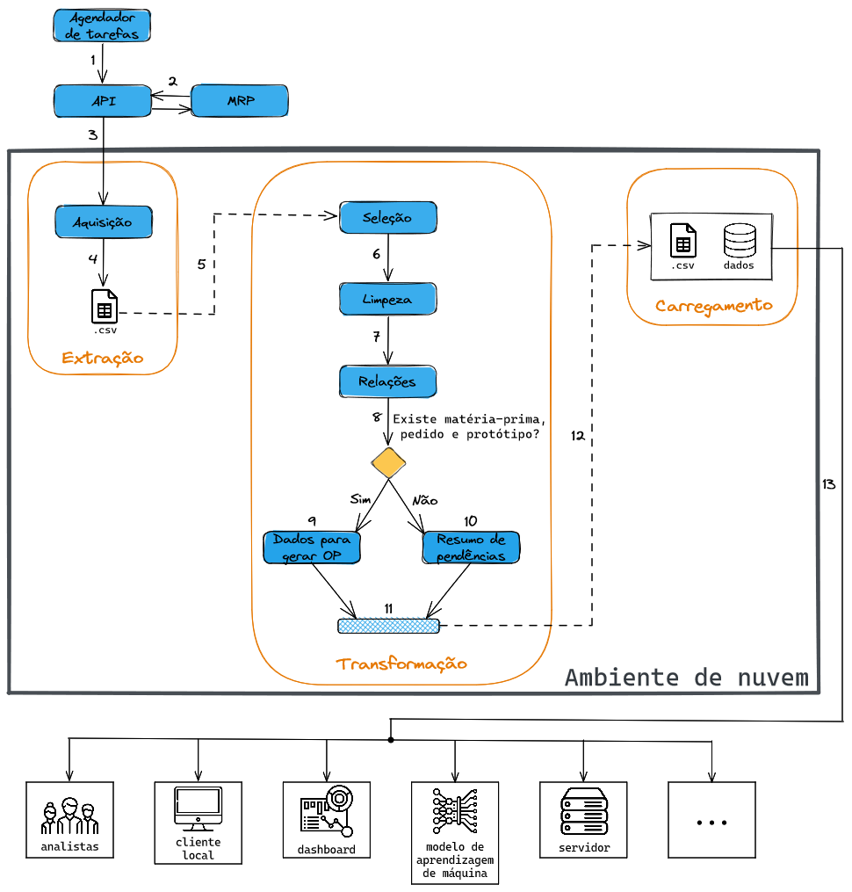
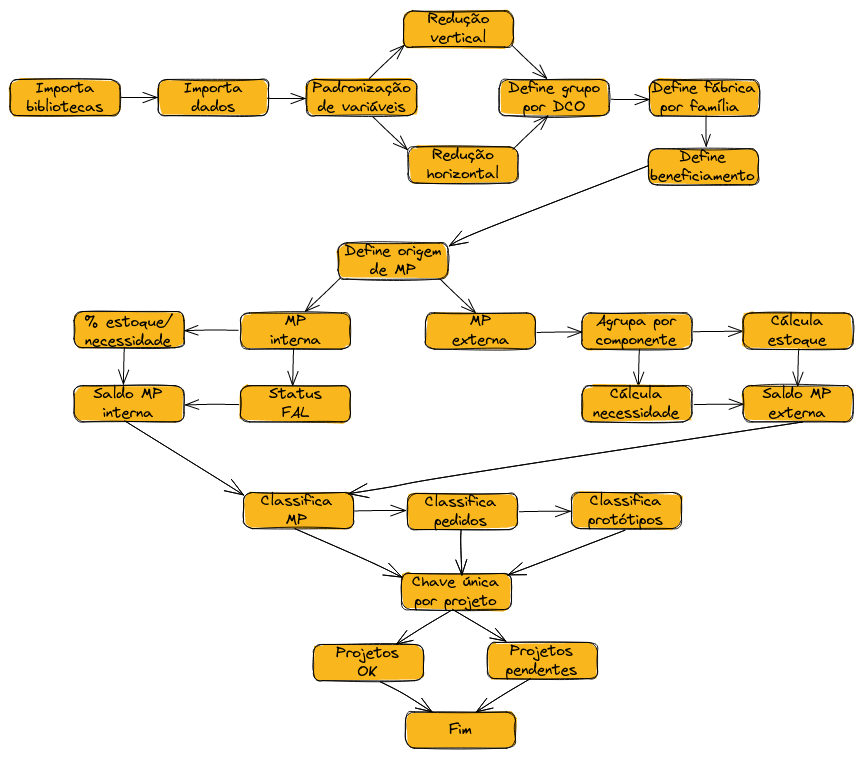

# Análise de dados para o PPCP: um estudo de caso

## ❓ Problema
A compamhia alvo do estudo de caso se trata de uma indústria têxtil e seus produtos se tratam principalmente de calças, blusas, vestidos e demais artigos de vestuário. Em meio a enorme quantidade de dados gerados e consumidos no decorrer de um complexo processo fabril, se faz necessária a implementação de uma solução que auxilie o setor de Planejamento, Programação e Controle da Produção (PPCP) a realizar uma de suas atividades-chave.

Dentre as principais atividades do setor de PPCP de uma indústria está a geração de Ordens de Produção (OP). Estas determinam o início do fluxo produtivo de determinado produto. Para que seja gerada uma OP, devem ser observadas as seguintes informações:
* a quantidade de matéria-prima suficiente para suprir a necessidade;
* o status do protótipo, que deve estar testado e aprovado pelo setor de engenharia;
* o status do pedido, que deve estar emitido pelo setor de estilo e produto.

As informações necessárias para executar a análise são organizadas naquele que é chamado de *Manufacturing Resources Planning* (MRP) e disponibilizadas em um arquivo em **formato tabular**. 

## 🗺️ Arquitetura da solução
Como solução, optou-se por um ambiente de programação dedicado a executar uma esteira de tarefas em ambiente de nuvem, que no fim gera informações essenciais para a tomada de decisão no que concerne a atividade de geração de ordens de produção. Para tal, é proposta a arquitetura ilustrada na figura abaixo.

    

## 🛠️ Manipulação dos dados
Um arquivo contendo os dados de entrada é lido e várias transformações são realizadas com objetivo de determinar quais produtos podem ou não ter sua OP gerada. Aqueles que não podem por possuir pêndencias relacionadas às variáveis citadas acima, devem ter essas especificadas, para que sejam posteriormente solucionadas. 

A figura abaixo ilustra um **DAG** com os passos realizados:

    

## 👷‍♀️ Como executar
### ☁️ Web
Para conhecer e navegar pelo projeto é recomendado acessar este 

Nele, não há necessidade importar manualmente os arquivos de entrada. Cada passo está organizado em seções, é possível visualisar textos explicativos e executar blocos de código individualmente. 
1. Para executar todas as células de uma só vez use o comando `ctrl+F9`

2. Para acessar os arquivos de saída, clique no menu à esquerda na aba "arquivos"

### 🖥️ Localmente
1. Primeiramente, certifique-se de ter o [Python](https://www.python.org/downloads/) instalado em sua máquina.
2. Instale as bibliotecas [Numpy](https://numpy.org/install/) e [Pandas](https://pandas.pydata.org/docs/getting_started/install.html).
3. Use `git clone <link-deste-projeto>` em seu terminal clonar o projeto.
4. Abra o arquivo `datascience_pcp.py` usando sua IDE preferida.
5. Adapte o caminho das pastas que contém as entradas para sua máquina. Faça isso alterando as variáveis `file_0`, `file_1` e `file_2`.
6. Adapte o caminho das pastas que receberão a saída para sua máquina. Faça isso alterando os três últimos comandos do código.
7. No terminal, use `python datascience_pcp.py` e execute.
8. Para conferir a saída, use o arquivo disponibilizado na pasta `saida esperada`.
